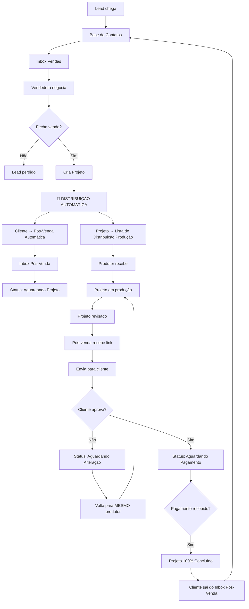

# Análise do Sistema Nobre Hub - Fluxo de Pós-Vendas

## 📋 Resumo Executivo

Esta análise documenta o estado atual do sistema e identifica todos os gaps entre o fluxo ideal descrito e a implementação existente.

---

## 🚀 Fluxo de Negócio Atualizado (Definição Final)

### Ciclo Completo do Cliente



---

### 🏭 Distribuição Automática de Produção

**Quando:** No momento que a vendedora **CRIA O PROJETO**

**Para onde:** Lista de Distribuição (visível apenas para Líder de Produção)

**Modos de distribuição:**

| Tipo | Descrição |
|------|-----------|
| **Randômica Equilibrada** | Considera: projetos ativos + complexidade (pontos) de cada produtor |
| **Manual pelo Líder** | Líder escolhe para qual produtor enviar |
| **Com Sugestão** | Vendedora sugere produtor → projeto marcado diferente na lista → líder envia manualmente |

**Complexidade/Pontos:**
- Determinada pelo **tipo de produto** (configurado em `GoalsPage.tsx`)
- Vendedora pode **aumentar manualmente** os pontos se projeto for mais complexo
- Vídeos têm pontuação por duração: 30s, 60s, 60+

**Informações mostradas na Lista de Distribuição:**
- Nome do projeto e cliente
- Tipo de produto e pontos
- Produtor sugerido (se houver) - **destacado visualmente**
- Quem atendeu esse cliente anteriormente (histórico)
- Observações da vendedora

**Sugestão de Produtor:**
- Projeto com sugestão fica destacado na lista (cor/ícone diferente)
- NÃO é distribuído automaticamente
- Líder pode ignorar sugestão e atribuir para outro

**Alterações (revisões):**
- SEMPRE voltam para o **MESMO produtor** que fez originalmente
- Líder pode reatribuir manualmente se necessário
- Alterações NUNCA vão para lista de distribuição

---

### 🏆 Sistema de Pontuação por Projeto (Metas de Produção)

**Configuração atual:** `GoalsPage.tsx`

| Configuração | Descrição |
|--------------|-----------|
| Meta diária por produtor | Quantos pontos cada produtor deve entregar/dia |
| Dias úteis (semana/mês) | Para cálculo de metas semanais/mensais |
| Pontos por produto | Cada produto ativo tem seu valor em pontos |
| Pontos por duração de vídeo | 30s / 60s / 60+ (para categoria Vídeo) |

**Cálculo de pontos por projeto:**
1. **Pontuação base:** Definida pelo tipo de produto
2. **Pontuação adicional:** Vendedora pode aumentar manualmente (complexidade extra)
3. **Fórmula:** `pontosFinais = pontosProduto + pontosExtras`

**Integração com Dashboard:**
- Ao concluir projeto, somar pontos para o produtor
- Comparar com meta diária/semanal/mensal
- Exibir ranking de produtores por pontos

---

### 📞 Distribuição de Pós-Vendas (LISTA + AUTOMÁTICO)

**Quando:** No momento que o projeto é **CRIADO** (venda fechada)

**Para onde:** Lista de Distribuição Pós-Vendas (visível para Líder)

> **MUDANÇA:** Pós-vendas agora tem lista de distribuição igual à produção!

**Efeito imediato ao criar projeto:**
- Cliente **SAI** do Inbox de Vendas
- Cliente **ENTRA** na Lista de Distribuição Pós-Vendas (aguardando)

**Modos de distribuição:**

| Tipo | Descrição |
|------|-----------|
| **Automática** | Balanceamento por clientes ativos |
| **Manual** | Líder escolhe para qual pós-venda enviar |

**Algoritmo de balanceamento:**
- Considera apenas clientes **ATIVOS** de cada pós-venda
- Clientes ativos = status "Aguardando Projeto" + "Aguardando Alteração"
- Distribui para quem tem menos clientes ativos

**Informações mostradas na Lista de Distribuição:**
- Nome do cliente e projeto
- Produtor que fez o projeto (relevante para pós-venda)
- Quem atendeu esse cliente anteriormente (histórico)
- Carga de trabalho de cada pós-venda

**Cliente retornando:**
- Não vai automaticamente para mesma pós-venda
- Lista mostra quem atendeu anteriormente
- Líder decide: manual ou randomizar

**Disponibilidade:**
- Configurável em `LeadDistributionPage.tsx` (Admin)
- Se TODAS as pós-vendas estiverem indisponíveis, cliente fica na lista aguardando

---

### 📥 Inbox Pós-Venda - Filtros/Abas

O Inbox do Pós-Venda deve ter filtros baseados no **status do cliente/projeto**:

| Filtro | Descrição | Quando |
|--------|-----------|--------|
| **Aguardando Projeto** | Cliente acabou de chegar, projeto em produção | Após distribuição para pós-venda |
| **Aguardando Alteração** | Projeto voltou para produção para ajustes | Após pós-venda solicitar alteração |
| **Entregue** | Projeto enviado ao cliente, aguardando aprovação | Após enviar link/vídeo |
| **Aguardando Pagamento** | Cliente aprovou, aguardando pagamento restante | Após cliente aprovar |
| **Todos** | Todos os clientes ativos | - |
| **Outros** | Casos especiais | - |

**Visualização do status do projeto:**
- Pós-venda vê status atualizado pela produção em tempo real
- Mostra **quem produziu** (nome do produtor)
- Status sincronizado via Firebase (`production_projects`)

---

### 👥 Múltiplos Projetos por Cliente

**Sim, um cliente pode ter mais de um projeto simultâneo!**

**Para Produção:**
- Simples: cada projeto é um card separado
- Pode estar com produtores diferentes

**Para Inbox (Vendas e Pós-Vendas):**
- Conversa única com vários projetos vinculados
- Mostrar lista de projetos ativos na conversa
- Status agregado: "2 projetos em produção, 1 aguardando pagamento"
- Filtros baseados em: cliente tem PELO MENOS UM projeto no status X

**Para Analytics:**
- Cada projeto conta separadamente nos pontos
- Cliente conta como ATIVO se tiver pelo menos 1 projeto ativo
- Métricas por projeto, não por cliente

**Schema:**
- `Lead.projectIds: string[]` - Array de IDs de projetos
- Cada `Project` tem seu próprio `clientApprovalStatus`, `paymentStatus`, etc.

---

### ✅ Definição de "Projeto Concluído"

Projeto é **100% concluído** quando:
1. ✅ Cliente **APROVOU** a entrega final
2. ✅ Pagamento foi **RECEBIDO**

Após conclusão de **TODOS os projetos** do cliente:
- Cliente sai do Inbox Pós-Venda
- Cliente volta para Base de Contatos
- Pode iniciar novo ciclo de venda futuramente

---

## 🎯 Fluxo Ideal vs Implementação Atual

### 1. **Lead chega → Cai na Base de Contatos → Vai para Inbox**

| Requisito | Status | Detalhes |
|-----------|--------|----------|
| Lead chega na base | ✅ Implementado | `LeadService.ts` e `ContactsPage.tsx` funcionam com dados reais do Firestore |
| Lead vai para inbox | ✅ Implementado | `InboxService.ts` com `subscribeToConversations()` funciona em tempo real |
| Distribuição de leads | ✅ Implementado | `InboxService.ts` tem `distributeUnassignedLeads()` e `getNextCollaborator()` |

---

### 2. **Vendedora Negocia e Fecha → Cria Projeto → Envia para Produção**

| Requisito | Status | Detalhes |
|-----------|--------|----------|
| Negociação no inbox | ✅ Parcial | Chat funciona, mas **valor do negócio é hardcoded** ("R$ 0,00" em `ProfilePanel.tsx:424`) |
| Marcar como Ganho/Perdido | ✅ Implementado | `dealStatus: 'won' \| 'lost' \| 'open'` funciona no `ProfilePanel.tsx` |
| Criar projeto após venda | 🔴 **CRÍTICO** | `CreateProjectModal.tsx` usa `leadId: 'manual'` hardcoded - **não vincula ao lead da venda** |
| Enviar para produção | ✅ Parcial | `ProductionService.createProject()` funciona, mas não há **lista de distribuição de projetos** |

#### Gaps Identificados:
- **`CreateProjectModal.tsx:55`**: Usa `source: 'manual'` e não passa o `leadId` real da conversa
- **Não existe trigger automático**: Quando `dealStatus = 'won'`, não dispara criação de projeto automática
- **Sem distribuição de produtores**: Não há equivalente ao `distributeUnassignedLeads` para projetos

---

### 3. **Projeto Passa pelas Etapas de Produção → Fica Pronto**

| Requisito | Status | Detalhes |
|-----------|--------|----------|
| Status de produção | ✅ Implementado | `ProjectStatus = 'aguardando' \| 'em-producao' \| 'a-revisar' \| 'revisado' \| 'alteracao'` |
| Board do produtor | ✅ Implementado | `ProjectBoard.tsx` com tabs Produção/Alterações/Finalizados |
| Iniciar/Finalizar projeto | ✅ Implementado | Botões "Iniciar" e "Finalizar" funcionam |
| Vincular link do Drive | ✅ Implementado | Campo `driveLink` no `Project` type |

#### Gaps Identificados:
- **Sem status "entregue"**: `ProjectStatus` não tem status de **entrega final ao cliente**
- **Sem notificação para pós-venda**: Quando projeto fica `revisado`, não avisa o pós-venda

---

### 4. **Lead Sai do Inbox de Vendas → Vai para Inbox de Pós-Venda**

| Requisito | Status | Detalhes |
|-----------|--------|----------|
| Inbox separado pós-venda | 🔴 **NÃO EXISTE** | Só existe 1 `InboxPage.tsx`, não há inbox específico para pós-venda |
| Transferir para setor pós-venda | 🔴 **NÃO EXISTE** | `ProfilePanel.tsx` só lista **vendedores** para transferência (linha 109-121) |
| Histórico de conversas anteriores | 🔴 **NÃO EXISTE** | Não há visualização do histórico de negociação anterior |

#### Gaps Críticos:

```tsx
// ProfilePanel.tsx:109-121 - Só filtra vendedores, ignora pós-venda
const salesCollaborators = useMemo(() => {
    const salesSectorIds = sectors
        .filter(s => s.name.toLowerCase().includes('vendas')) // ❌ Não inclui pós-venda
        .map(s => s.id);
    // ...
}, [collaborators, sectors, teamStatus]);
```

---

### 5. **Pós-Venda Atualiza Cliente sobre Progresso + Visualiza Status**

| Requisito | Status | Detalhes |
|-----------|--------|----------|
| Ver status do projeto | 🔴 **NÃO EXISTE** | Inbox não mostra projetos vinculados à conversa |
| Ver com quem está o projeto | 🔴 **NÃO EXISTE** | Não há visualização do produtor responsável no chat |
| Atualizar cliente sobre progresso | 🟡 Parcial | Pode mandar mensagem, mas sem templates/atalhos de status |

#### O que falta:
- **Componente de status do projeto no Inbox**: Panel que mostra projeto vinculado, produtor, status atual
- **Templates de mensagem para atualização**: "Seu projeto está em produção", "50% concluído", etc.

---

### 6. **Projeto Finalizado → Link Chega no Pós-Venda → Envia para Cliente**

| Requisito | Status | Detalhes |
|-----------|--------|----------|
| Notificação de projeto pronto | 🔴 **NÃO EXISTE** | Não há sistema de notificações |
| Baixar vídeo do Drive | 🔴 **NÃO EXISTE** | Só tem link externo, não download direto |
| Enviar vídeo pelo inbox | 🟡 Parcial | `sendMediaMessage()` existe, mas fluxo não está integrado |

---

### 7. **Cliente Aprova ou Pede Alteração → Devolve para Produtor**

| Requisito | Status | Detalhes |
|-----------|--------|----------|
| Marcar como aprovado | 🔴 **NÃO EXISTE** | Não tem status de **aprovação pelo cliente** |
| Enviar para alteração | 🔴 **PARCIAL** | `ProjectDetailsModal.tsx` tem status `alteracao`, mas não dispara do inbox |
| Vincular ao mesmo produtor | ✅ Implementado | `producerId` mantido no projeto |

#### Gap Crítico:
- **Sem ação "Solicitar Alteração" no Inbox**: Pós-venda deveria poder clicar e enviar de volta para produção

---

### 8. **Cliente Aprova → Projeto Concluído → Encerra Conversa**

| Requisito | Status | Detalhes |
|-----------|--------|----------|
| Marcar projeto como concluído | 🔴 **NÃO EXISTE** | `ProjectStatus` não tem status `concluido` |
| Encerrar conversa | ✅ Implementado | `toggleConversationStatus()` fecha conversa |
| Lead volta para base de contatos | ✅ Automático | Leads sempre estão na base `leads` |

---

### 9. **Modal 360° Mostra Histórico Completo**

| Requisito | Status | Detalhes |
|-----------|--------|----------|
| Tags de cliente antigo | 🟡 Parcial | `tags[]` existe, mas não há lógica automática |
| Negócios fechados | 🔴 **MOCK** | `NegociosTab.tsx` **não persiste dados** - apenas toast fake |
| Qual produtor fez | 🔴 **NÃO EXISTE** | Não vincula projetos ao lead no modal |
| Qual pós-venda atendeu | 🔴 **NÃO EXISTE** | Não há campo `postSalesId` |
| Histórico completo | 🔴 **HARDCODED** | `HistoricoTab.tsx` só mostra 2 items mock |

```tsx
// HistoricoTab.tsx:12-25 - Timeline hardcoded
const timeline = [
    { id: '1', title: 'Lead criado', ... },
    { id: '2', title: 'Última atualização', ... },
    // ❌ Nada sobre: vendedora, produção, pós-venda, projetos
];
```

---

## 🔧 Resumo dos Gaps por Prioridade

### 🔴 CRÍTICOS (Bloqueiam o fluxo)

1. **Inbox de Pós-Vendas não existe**
   - Criar nova rota `/inbox/pos-venda`
   - Ou filtrar por setor do usuário logado

2. **Projeto não vincula ao Lead**
   - `CreateProjectModal.tsx` precisa receber `leadId` real
   - Adicionar campo `projectIds[]` no Lead type

3. **Transferência ignora Pós-Venda**
   - `ProfilePanel.tsx` precisa incluir setor "Pós-Venda"
   - Ou ter ação separada "Enviar para Pós-Venda"

4. **Sem visualização de projeto no Inbox**
   - Adicionar componente que mostra projeto vinculado
   - Mostrar: nome, status, produtor, driveLink

5. **Ação "Solicitar Alteração" falta**
   - Botão no Inbox que muda status do projeto para `alteracao`

### 🟡 IMPORTANTES (Melhoram o fluxo)

6. **Notificações não existem**
   - Criar sistema de alertas
   - Notificar pós-venda quando projeto fica pronto

7. **Histórico do Lead é mock**
   - `HistoricoTab.tsx` precisa buscar eventos reais
   - Criar collection `lead_activities` ou `lead_history`

8. **NegociosTab não persiste**
   - Salvar dados no Firestore ao invés de só toast

9. **Status "concluído" falta**
   - Adicionar `'concluido'` ao `ProjectStatus`
   - Workflow: `revisado` → `entregue` → `concluido`

### 🟢 NICE TO HAVE

10. **Templates de atualização de status**
    - Mensagens prontas: "Em produção", "Alteração solicitada", etc.

11. **Download direto do Drive**
    - Integração com Google Drive API

12. **Tags automáticas de cliente**
    - Quando fecha negócio, adiciona tag "Cliente"

---

## 📊 Types/Schema que Precisam Mudar

### `Lead` type (src/types/lead.types.ts)
```typescript
export interface Lead {
    // ... campos existentes ...
    
    // ADICIONAR:
    projectIds?: string[];        // Projetos vinculados
    postSalesId?: string;         // Atendente pós-venda
    closedDeals?: ClosedDeal[];   // Histórico de negócios
    source?: string;              // Origem do lead
}

interface ClosedDeal {
    projectId: string;
    producerId: string;
    sellerId: string;
    value: number;
    closedAt: Date;
}
```

### `Project` type (src/types/project.types.ts)
```typescript
export type ProjectStatus = 
    | 'aguardando' 
    | 'em-producao' 
    | 'a-revisar' 
    | 'revisado' 
    | 'alteracao'
    | 'entregue'        // ADICIONAR
    | 'concluido';      // ADICIONAR

export interface Project {
    // ... campos existentes ...
    
    // ADICIONAR:
    postSalesId?: string;         // Quem do pós-venda
    clientApprovalStatus?: 'pending' | 'approved' | 'changes_requested';
    approvedAt?: Date;
    deliveredToClientAt?: Date;
}
```

### `Conversation` type (src/features/inbox/types.ts)
```typescript
export interface Conversation {
    // ... campos existentes ...
    
    // ADICIONAR:
    context?: 'sales' | 'post_sales';  // Contexto da conversa
    projectId?: string;                 // Projeto vinculado
    previousConversationId?: string;    // Link para histórico
}
```

---

## 📁 Componentes que Precisam Ser Criados/Modificados

### Novos Componentes Necessários:

| Componente | Descrição |
|------------|-----------|
| `PostSalesInboxPage.tsx` | Página específica para inbox pós-venda (ou filtro) |
| `ProjectStatusPanel.tsx` | Painel no inbox mostrando projeto vinculado |
| `SendForAlterationButton.tsx` | Botão que envia projeto de volta para produção |
| `ClientApprovalActions.tsx` | Ações: Aprovar / Solicitar Alteração |
| `ProjectHistoryTimeline.tsx` | Timeline real de eventos do projeto |

### Modificações Necessárias:

| Arquivo | Modificação |
|---------|-------------|
| `ProfilePanel.tsx` | Adicionar setor Pós-Venda na transferência |
| `CreateProjectModal.tsx` | Receber leadId real da conversa |
| `InboxPage.tsx` | Filtrar por setor (vendas vs pós-venda) |
| `NegociosTab.tsx` | Persistir dados no Firestore |
| `HistoricoTab.tsx` | Buscar eventos reais, não mock |
| `ProjectBoard.tsx` | Adicionar aba "Entregues" |
| `ProductionService.ts` | Métodos para distribuição de projetos |

---

## 🔄 Fluxo de Dados Proposto

```
┌──────────────┐     ┌──────────────┐     ┌──────────────┐
│    VENDAS    │     │  PRODUÇÃO    │     │  PÓS-VENDA   │
├──────────────┤     ├──────────────┤     ├──────────────┤
│ 1. Lead chega│     │              │     │              │
│ 2. Negocia   │     │              │     │              │
│ 3. Fecha     │────▶│ 4. Projeto   │     │              │
│    (won)     │     │    criado    │     │              │
│              │     │ 5. Produz    │     │              │
│              │     │ 6. Finaliza  │────▶│ 7. Recebe    │
│              │     │              │     │    projeto   │
│              │     │              │     │ 8. Atualiza  │
│              │     │              │◀────│    cliente   │
│              │     │ 9. Alteração │     │ (se preciso) │
│              │     │ 10.Re-entrega│────▶│11. Cliente   │
│              │     │              │     │    aprova    │
│              │     │              │     │12. Conclui   │
└──────────────┘     └──────────────┘     └──────────────┘
                                                 │
                                                 ▼
                                         Lead volta para
                                          Base + Tags
```

---

## ⚠️ Observações Importantes

1. **Mock Data Identificado:**
   - `ProfilePanel.tsx:508-522` - Histórico hardcoded
   - `HistoricoTab.tsx:12-25` - Timeline fake
   - `NegociosTab.tsx:52-55` - handleSave só faz toast

2. **Console.logs Excessivos:**
   - `LeadService.ts`, `InboxService.ts` têm muitos logs de debug

3. **Seed Data:**
   - `InboxService.ts:500-607` tem dados de seed que precisam ser removidos em produção

4. **Permissões:**
   - Precisa criar permissões específicas para pós-venda:
     - `view_post_sales_inbox`
     - `manage_delivery`
     - `request_alterations`

---

## 📊 Dashboard Analytics - Métricas que Dependem do Fluxo

### Estado Atual do Dashboard

O sistema possui um **DashboardAnalyticsService** com 6 seções de métricas:

| Seção | Status | Dados Reais? |
|-------|--------|--------------|
| **Production** | ✅ Implementado | Sim - collection `projects` |
| **Sales** | ✅ Implementado | Sim - collection `leads` |
| **Admin** | ✅ Implementado | Sim - collection `collaborators` |
| **Financial** | 🔴 Parcial | Sim (receita), Não (despesas) |
| **Post-Sales** | 🔴 **PLACEHOLDERS** | **Não - retorna zeros** |
| **General** | ✅ Implementado | Agregado das outras |

---

### 🔴 PostSalesMetrics - Todas PLACEHOLDERS

O arquivo `DashboardAnalyticsService.ts` (linhas 1118-1187) implementa `getPostSalesMetrics()`, porém **todos os valores são zeros ou placeholders**:

```typescript
// Linhas 1169-1186 - Tudo retorna zero ou vazio
return {
    openTickets: 0,              // TODO: collection 'tickets' not exists
    resolvedTickets: 0,          // TODO: collection 'tickets' not exists
    avgResolutionTime: 0,        // TODO: needs ticket timestamps
    customerSatisfaction: 0,     // TODO: needs feedback collection
    churnRate: 0,                // TODO: needs customer tracking
    retentionRate: 0,            // TODO: needs customer tracking
    npsScore: 0,                 // TODO: needs NPS survey
    ticketsTrend: [],            // Empty array
    totalPaymentsReceived: 0,    // TODO: collection 'payments' not exists
    paymentsTrend: [],           // Empty array
    topPostSellers: [/*...*/],   // Lista colaboradores do setor, mas paymentsReceived = 0
};
```

#### Ranking de Pós-Vendedoras (linhas 1140-1152)
O ranking já busca colaboradores do setor "Pós-vendas" (ID `2OByfKttFYPi5Cxbcs2t`), **mas todos os campos de performance são zero**:

```typescript
const topPostSellers = postSalesTeam.map(doc => ({
    id: doc.id,
    name: data.name,
    photoUrl: data.photoUrl,
    paymentsReceived: 0,    // TODO: Sum from payments collection
    ticketsResolved: 0,     // TODO: Count from tickets collection
    avgRating: 0,           // TODO: Average from customer feedback
}));
```

---

### 🎯 Collections Necessárias para Métricas Reais

#### 1. Collection: `tickets` ou `support_tickets`

| Campo | Tipo | Para métrica |
|-------|------|--------------|
| `id` | string | Identificador |
| `leadId` | string | Qual cliente |
| `projectId` | string | Qual projeto |
| `postSalesId` | string | Quem atendeu |
| `status` | 'open' \| 'in_progress' \| 'resolved' | openTickets, resolvedTickets |
| `createdAt` | Date | ticketsTrend.opened |
| `resolvedAt` | Date | ticketsTrend.resolved, avgResolutionTime |
| `category` | string | Tipo de suporte |

#### 2. Collection: `payments` ou `post_sales_payments`

| Campo | Tipo | Para métrica |
|-------|------|--------------|
| `id` | string | Identificador |
| `leadId` | string | Qual cliente |
| `projectId` | string | Qual projeto |
| `postSalesId` | string | Quem recebeu |
| `amount` | number | totalPaymentsReceived, topPostSellers.paymentsReceived |
| `paidAt` | Date | paymentsTrend |
| `type` | 'final' \| 'partial' | Tipo do pagamento |

#### 3. Collection: `customer_feedback` ou adicionar campo ao Project

| Campo | Tipo | Para métrica |
|-------|------|--------------|
| `projectId` | string | Qual projeto |
| `leadId` | string | Qual cliente |
| `postSalesId` | string | Quem atendeu |
| `rating` | 1-5 | customerSatisfaction, topPostSellers.avgRating |
| `npsScore` | 0-10 | npsScore |
| `feedbackAt` | Date | Quando avaliou |
| `comment` | string | Feedback textual |

---

### 📈 Dados a Capturar Durante o Fluxo

#### Ao Fechar Venda (dealStatus = 'won'):
- [ ] Criar registro de negócio fechado com valor
- [ ] Vincular projeto ao lead
- [ ] Registrar vendedora responsável

#### Ao Criar Projeto:
- [ ] Vincular `leadId` real (não 'manual')
- [ ] Registrar `sellerId` (quem vendeu)
- [ ] Data de início

#### Ao Finalizar Projeto (status = 'revisado'):
- [ ] Notificar setor pós-venda
- [ ] Criar "ticket" de entrega automaticamente
- [ ] Registrar data de finalização

#### Ao Transferir para Pós-Venda:
- [ ] Registrar `postSalesId` no projeto
- [ ] Registrar data de transferência
- [ ] Criar conversa com contexto 'post_sales'

#### Ao Entregar ao Cliente:
- [ ] Registrar `deliveredToClientAt`
- [ ] Atualizar status do ticket para 'resolved'
- [ ] Solicitar feedback/avaliação

#### Ao Receber Pagamento Final:
- [ ] Criar registro em `payments`
- [ ] Vincular ao `postSalesId` que fechou
- [ ] Registrar valor e data

#### Ao Cliente Solicitar Alteração:
- [ ] Criar novo ticket ou marcar ticket existente
- [ ] Atualizar `clientApprovalStatus = 'changes_requested'`
- [ ] Voltar projeto para produção

#### Ao Cliente Aprovar:
- [ ] Registrar `clientApprovalStatus = 'approved'`
- [ ] Registrar `approvedAt`
- [ ] Solicitar NPS
- [ ] Fechar ticket definitivamente

---

### 🔗 Componente Visual Pronto

O arquivo `PostSalesStats.tsx` (225 linhas) **já está implementado** e pronto para exibir:

1. **Ranking de Pós-Vendedoras** - Com foto, nome, tickets resolvidos, rating e pagamentos recebidos
2. **Total de Pagamentos Recebidos** - Card com valor formatado em R$
3. **Tickets Abertos** - Card com contador
4. **Tickets Resolvidos** - Card com contador
5. **Satisfação do Cliente** - Porcentagem com cores (verde/amarelo/vermelho)
6. **Taxa de Retenção** - Porcentagem com cores

**O componente está pronto, só falta popular os dados!**

---

## 🚧 Outras Funcionalidades Incompletas Identificadas

### 1. CRM - Ações em Massa (`ContactsQuickActions.tsx`)

**Status:** 🔴 **5 ações são apenas console.log**

| Ação | Linha | Status |
|------|-------|--------|
| Atribuir Vendedora | 236-241 | `console.log()` apenas |
| Atribuir Pós-Venda | 244-249 | `console.log()` apenas |
| Mover para Etapa | 252-258 | `console.log()` apenas |
| Marcar como Perdido | 261-266 | `console.log()` apenas |
| Excluir em Massa | 269-273 | `console.log()` apenas |

**Funcional:**
- ✅ Adicionar Tag (integrado com LeadService)
- ✅ Remover Tag (integrado com LeadService)
- ✅ Exportar CSV (funcional)

---

### 2. Lead 360° - Tabs Incompletas

#### HistoricoTab.tsx (52 linhas)
**Status:** 🔴 **Timeline hardcoded**

```typescript
// Linhas 12-25 - Apenas 2 items fixos
const timeline = [
    { id: '1', title: 'Lead criado', time: lead.createdAt },
    { id: '2', title: 'Última atualização', time: lead.updatedAt }
];
```

**Deveria mostrar:**
- [ ] Histórico de atribuições (quem atendeu)
- [ ] Etapas do funil percorridas
- [ ] Projetos vinculados ao lead
- [ ] Mensagens enviadas
- [ ] Negócio fechado (data, valor, produto)

#### NegociosTab.tsx (212 linhas)
**Status:** 🔴 **handleSave não persiste dados**

```typescript
// Linha 52-55 - Só mostra toast, não salva!
const handleSave = () => {
    toast.success('Informações do negócio salvas!');
    setIsEditing(false);
};
```

**Campos não salvos:**
- dealValue (valor do negócio)
- productAcquired (produto adquirido)
- temperature (temperatura do lead)
- recordingLink (link de gravação)
- notes (notas do negócio)

---

### 3. Inbox - Funcionalidades Faltando

#### ChatHeader.tsx (381 linhas)
| Ação | Linha | Status |
|------|-------|--------|
| Arquivar conversa | 354-358 | `// TODO: Implement archive/unarchive` |
| Bloquear contato | 364-369 | `// TODO: Implement block functionality` |

#### Mobile Navigation
**Status:** 🔴 **Navegação mobile não implementada**

```css
/* InboxPage.module.css linha 102 */
/* Mobile: Apenas um painel por vez (TODO: implementar navegação) */

/* TeamChatPage.module.css linha 103 */
/* Mobile: Apenas um painel por vez (TODO: implementar navegação) */
```

---

### 4. Team - Métricas de Colaboradores

#### CollaboratorProfileModal.tsx (756 linhas)

**Status:** 🔴 **Todas as métricas são hardcoded**

**Tab Metas:**
- Usa `generateMockGoalHistory()` (linhas 120-243)
- Dados simulados baseados em hash do ID
- Não consulta projetos reais

**Tab Métricas - Produção (linhas 602-644):**
```typescript
<span className={styles.metricValue}>127</span>  // HARDCODED
<span className={styles.metricValue}>18</span>   // HARDCODED
<span className={styles.metricValue}>85%</span>  // HARDCODED
<span className={styles.metricValue}>2.3 dias</span> // HARDCODED
```

**Tab Métricas - Vendas (linhas 647-689):**
```typescript
<span className={styles.metricValue}>R$ 47.500</span> // HARDCODED
<span className={styles.metricValue}>12</span> // HARDCODED
<span className={styles.metricValue}>32%</span> // HARDCODED
<span className={styles.metricValue}>R$ 3.958</span> // HARDCODED
```

**Tab Métricas - Pós-Vendas (linhas 692-733):**
```typescript
<span className={styles.metricValue}>R$ 32.800</span> // HARDCODED
<span className={styles.metricValue}>4.2h</span> // HARDCODED
<span className={styles.metricValue}>45</span> // HARDCODED
<span className={styles.metricValue}>94%</span> // HARDCODED
```

**Tab Métricas - Estratégico:**
- Mostra "Em breve" (linhas 738-746)

---

### 5. Dashboard - Métricas Faltando

#### SalesStats (`DashboardAnalyticsService.ts`)
**Status:** 🟡 **Parcialmente hardcoded**

```typescript
// Linhas 858-861 - Placeholders de performance
avgResponseTime: 4.5,      // TODO: Calculate from lead activity history
avgCycleTime: 14,          // TODO: Calculate from lead lifecycle
followUpRate: 85,          // TODO: Calculate from activity tracking
```

#### GeneralStats.tsx (linhas 38-44)
```typescript
// TODO: Implement clients module to get real client count
// overdueProjects: 0, // TODO: Calculate from projects with deadline < now
```

#### DashboardPage.tsx (linha 51)
```typescript
// Filtro personalizado de data
// TODO: Open date picker modal
```

---

### 6. Produção - Projetos sem Vínculo

#### CreateProjectModal
**Status:** 🔴 **leadId é sempre 'manual'**

O modal de criação de projeto não permite selecionar um lead existente.
Todos os projetos são criados com `leadId: 'manual'`.

**Consequência:**
- Não há rastreabilidade Lead → Projeto → Pós-venda
- Dashboard não consegue calcular métricas de conversão correta
- Histórico do lead não mostra projetos vinculados

---

### 7. Technical Debt

| Área | Issue |
|------|-------|
| Logging | Excessivo `console.log` em LeadService, InboxService |
| Types | Lead e Project faltam campos semânticos para transições |
| Seeds | InboxService contém dados hardcoded para seeding |
| Backend | CollaboratorService tem TODO para integrar endpoints |

---

## 🔥 Estrutura Firebase - Schema Proposto

### Collections Existentes (Modificações)

#### Collection: `leads`

**Campos atuais:**
```typescript
{
  id: string,
  name: string,
  email?: string,
  phone: string,
  company?: string,
  pipeline: 'high-ticket' | 'low-ticket',
  status: string,
  order: number,
  estimatedValue?: number,
  tags: string[],
  responsibleId: string,
  customFields?: Record<string, unknown>,
  notes?: string,
  lostReason?: string,
  lostAt?: Date,
  createdAt: Date,
  updatedAt: Date
}
```

**Novos campos a adicionar:**
```typescript
{
  // ... campos existentes ...

  // Pós-Venda (VIA LISTA DE DISTRIBUIÇÃO)
  postSalesId?: string,           // ID do responsável pós-venda
  postSalesAssignedAt?: Date,     // Quando foi atribuído
  postSalesDistributionStatus?: 'pending' | 'assigned',  // Status na lista pós-venda

  // Negócio fechado
  dealStatus?: 'open' | 'won' | 'lost',
  dealValue?: number,             // Valor final do negócio
  dealClosedAt?: Date,            // Quando o negócio foi fechado
  dealProductId?: string,         // Produto adquirido
  dealNotes?: string,             // Notas do negócio

  // Status do Cliente no Pós-Vendas (para filtros do inbox)
  clientStatus?: 'aguardando_projeto' | 'aguardando_alteracao' | 'entregue' | 'aguardando_pagamento' | 'concluido',

  // Vinculação com projetos (MÞLTIPLOS PROJETOS)
  projectIds?: string[],          // Array de IDs de projetos vinculados

  // Histórico de atendimento (para destaque na lista de distribuição)
  previousPostSalesIds?: string[],   // Quem já atendeu esse cliente
  previousProducerIds?: string[],    // Quem já produziu pra esse cliente

  // Metadados adicionais
  temperature?: 'cold' | 'warm' | 'hot',
  origin?: string,
  conversationId?: string,

  // Contexto de setor (para filtrar inbox)
  currentSector?: 'vendas' | 'pos_vendas' | 'distribution',  // Em qual lugar o cliente está
}
```

---

#### Collection: `production_projects`

**Campos atuais:**
```typescript
{
  id: string,
  name: string,
  leadId: string,
  leadName: string,
  driveLink?: string,
  dueDate: Date,
  producerId: string,
  producerName: string,
  status: 'aguardando' | 'em-producao' | 'a-revisar' | 'revisado' | 'alteracao',
  priority?: 'normal' | 'high',
  notes?: string,
  checklist: ProjectChecklistItem[],
  source: 'manual' | 'automation' | string,
  externalId?: string,
  metadata?: Record<string, any>,
  tags?: string[],
  deliveredAt?: Date,
  createdAt: Date,
  updatedAt: Date
}
```

**Novos campos a adicionar:**
```typescript
{
  // ... campos existentes ...

  // Novos status
  status: '...' | 'entregue' | 'concluido',  // Adicionar status finais

  // PONTUAÇÃO (para metas de produção)
  productType?: string,           // Tipo de produto (link para products collection)
  durationCategory?: '30s' | '60s' | '60plus',  // Categoria de duração (só vídeos)
  basePoints?: number,            // Pontos base do produto
  extraPoints?: number,           // Pontos extras adicionados pela vendedora
  totalPoints?: number,           // basePoints + extraPoints (calculado)

  // DISTRIBUIÇÃO DE PRODUÇÃO
  distributionStatus?: 'pending' | 'assigned' | 'suggested',  // Status na lista
  suggestedProducerId?: string,   // Produtor sugerido pela vendedora
  suggestedProducerName?: string,
  suggestionNotes?: string,       // Observações da vendedora
  assignedByLeaderId?: string,    // Líder que atribuiu (se manual)
  assignedAt?: Date,              // Quando foi atribuído ao produtor

  // Pós-Venda (VIA LISTA DE DISTRIBUIÇÃO)
  postSalesId?: string,           // Responsável pós-venda
  postSalesName?: string,
  postSalesAssignedAt?: Date,     // Quando cliente foi atribuído

  // Entrega ao cliente
  deliveredToClientAt?: Date,     // Quando foi entregue ao cliente final
  deliveredToClientBy?: string,   // Quem entregou (postSalesId)

  // Aprovação do cliente
  clientApprovalStatus?: 'pending' | 'approved' | 'changes_requested',
  clientApprovedAt?: Date,
  clientFeedback?: string,

  // Pagamento
  paymentStatus?: 'pending' | 'partial' | 'paid',
  paymentReceivedAt?: Date,
  paymentReceivedBy?: string,

  // Histórico de revisões (alterações voltam para o MESMO produtor)
  revisionCount?: number,         // Quantas vezes voltou para alteração
  lastRevisionRequestedAt?: Date,
  lastRevisionRequestedBy?: string
}
```

---

#### Collection: `conversations`

**Novos campos a adicionar:**
```typescript
{
  // ... campos existentes ...

  // Contexto da conversa
  context?: 'sales' | 'post_sales',   // Em qual setor está
  projectId?: string,                  // Projeto vinculado (se pós-venda)

  // Metadados
  leadId?: string,                     // Lead vinculado
  transferHistory?: Array<{
    from: string,                      // collaboratorId
    to: string,
    at: Date,
    reason?: string
  }>
}
```

---

### Novas Collections a Criar

#### Collection: `lead_activities`

**Propósito:** Registrar todas as atividades/eventos de um lead para o histórico.

```typescript
{
  id: string,
  leadId: string,
  type: 'created' | 'status_change' | 'stage_change' | 'assignment' |
        'message_sent' | 'message_received' | 'deal_won' | 'deal_lost' |
        'project_created' | 'project_delivered' | 'post_sales_assigned' |
        'payment_received' | 'note_added',
  description: string,
  userId: string,                    // Quem realizou a ação
  metadata?: {
    fromStatus?: string,
    toStatus?: string,
    fromStage?: string,
    toStage?: string,
    projectId?: string,
    value?: number,
    // ... outros dados contextuais
  },
  createdAt: Date
}
```

---

#### Collection: `tickets` (ou `support_tickets`)

**Propósito:** Tickets de suporte/entrega para pós-vendas.

```typescript
{
  id: string,
  leadId: string,
  leadName: string,
  projectId: string,
  projectName: string,

  // Responsável
  postSalesId: string,
  postSalesName: string,

  // Status
  status: 'open' | 'in_progress' | 'waiting_client' | 'resolved' | 'cancelled',
  category: 'entrega' | 'suporte' | 'alteracao' | 'pagamento' | 'outro',
  priority: 'low' | 'normal' | 'high' | 'urgent',

  // Descrição
  title: string,
  description?: string,

  // Timestamps
  createdAt: Date,
  updatedAt: Date,
  resolvedAt?: Date,
  resolvedBy?: string,

  // SLA
  dueDate?: Date,
  firstResponseAt?: Date,
  resolutionTime?: number  // em minutos
}
```

---

#### Collection: `payments`

**Propósito:** Registrar pagamentos recebidos pelo pós-venda.

```typescript
{
  id: string,
  leadId: string,
  leadName: string,
  projectId: string,
  projectName: string,

  // Responsável que recebeu
  postSalesId: string,
  postSalesName: string,

  // Valores
  amount: number,
  type: 'entrada' | 'parcela' | 'final' | 'adicional',
  method?: 'pix' | 'boleto' | 'cartao' | 'transferencia' | 'outro',

  // Status
  status: 'pending' | 'confirmed' | 'cancelled',

  // Timestamps
  dueDate?: Date,           // Vencimento
  paidAt?: Date,            // Quando foi confirmado
  createdAt: Date,
  confirmedBy?: string      // Quem confirmou o recebimento
}
```

---

#### Collection: `customer_feedback`

**Propósito:** NPS e avaliações de clientes.

```typescript
{
  id: string,
  leadId: string,
  leadName: string,
  projectId: string,
  projectName: string,

  // Responsáveis
  sellerId?: string,        // Vendedora que fechou
  postSalesId?: string,     // Pós-venda que entregou
  producerId?: string,      // Produtor que fez

  // Avaliação
  rating: 1 | 2 | 3 | 4 | 5,      // Estrelas
  npsScore?: 0 | 1 | 2 | 3 | 4 | 5 | 6 | 7 | 8 | 9 | 10,
  comment?: string,

  // Categorias
  categories?: {
    qualidade?: 1 | 2 | 3 | 4 | 5,
    comunicacao?: 1 | 2 | 3 | 4 | 5,
    prazo?: 1 | 2 | 3 | 4 | 5,
    atendimento?: 1 | 2 | 3 | 4 | 5
  },

  // Metadata
  requestedAt?: Date,
  submittedAt: Date,
  source: 'automatic' | 'manual' | 'email' | 'whatsapp'
}
```

---

### Indexes Recomendados

```javascript
// leads
{ responsibleId: 1, status: 1 }
{ postSalesId: 1 }
{ dealStatus: 1, dealClosedAt: -1 }
{ pipeline: 1, status: 1 }

// production_projects
{ producerId: 1, status: 1 }
{ postSalesId: 1, status: 1 }
{ leadId: 1 }
{ status: 1, createdAt: -1 }

// tickets
{ postSalesId: 1, status: 1 }
{ leadId: 1 }
{ projectId: 1 }
{ status: 1, createdAt: -1 }

// payments
{ postSalesId: 1, paidAt: -1 }
{ leadId: 1 }
{ projectId: 1 }
{ status: 1, dueDate: 1 }

// lead_activities
{ leadId: 1, createdAt: -1 }
{ type: 1, createdAt: -1 }

// customer_feedback
{ postSalesId: 1, submittedAt: -1 }
{ npsScore: 1 }
{ projectId: 1 }
```

---

## ✅ Checklist Completo de Implementação

### Fase 1: Schema & Types

- [ ] **1.1** Atualizar `src/types/lead.types.ts`
  - [ ] Adicionar campos: `postSalesId`, `dealStatus`, `dealValue`, `projectIds`, `temperature`
  - [ ] Adicionar campo: `clientStatus` para filtros do inbox pós-venda
  - [ ] Adicionar campo: `currentSector` ('vendas' | 'pos_vendas')
  - [ ] Criar type `DealStatus = 'open' | 'won' | 'lost'`
  - [ ] Criar type `ClientStatus = 'aguardando_projeto' | 'aguardando_alteracao' | 'entregue' | 'aguardando_pagamento' | 'concluido'`

- [ ] **1.2** Atualizar `src/types/project.types.ts`
  - [ ] Adicionar status: `'entregue'`, `'concluido'`
  - [ ] Adicionar campos de distribuição: `distributionStatus`, `suggestedProducerId`, `complexity`
  - [ ] Adicionar campos: `postSalesId`, `clientApprovalStatus`, `paymentStatus`
  - [ ] Criar type `DistributionStatus = 'pending' | 'assigned' | 'suggested'`
  - [ ] Criar type `ClientApprovalStatus = 'pending' | 'approved' | 'changes_requested'`

- [ ] **1.3** Criar `src/types/ticket.types.ts`
  - [ ] Interface `Ticket` com todos os campos documentados

- [ ] **1.4** Criar `src/types/payment.types.ts`
  - [ ] Interface `Payment` com todos os campos documentados

- [ ] **1.5** Criar `src/types/feedback.types.ts`
  - [ ] Interface `CustomerFeedback` com todos os campos documentados

- [ ] **1.6** Atualizar `src/types/index.ts`
  - [ ] Exportar novos types

---

### Fase 2: Services & Stores - Distribuição

- [ ] **2.1** Criar `ProductionDistributionService.ts` (LISTA DE DISTRIBUIÇÃO)
  - [ ] Método `addToDistributionQueue(project)` - adicionar projeto à fila
  - [ ] Método `getDistributionQueue()` - listar projetos pendentes (só líder vê)
  - [ ] Método `autoAssignProject(projectId)` - distribuição randômica equilibrada
  - [ ] Método `manualAssignProject(projectId, producerId)` - líder atribui manualmente
  - [ ] Método `calculateProducerLoad(producerId)` - calcular projetos ativos + complexidade

- [ ] **2.2** Criar `PostSalesDistributionService.ts` (AUTOMÁTICO)
  - [ ] Método `autoAssignClient(leadId)` - distribui automático ao criar projeto
  - [ ] Método `getAvailablePostSales()` - listar pós-vendas disponíveis
  - [ ] Método `calculateClientLoad(postSalesId)` - contar clientes ativos
  - [ ] Integrar com `LeadDistributionPage.tsx` para disponibilidade

- [ ] **2.3** Criar `TicketService.ts`
  - [ ] CRUD completo para tickets
  - [ ] Métodos: `createDeliveryTicket()`, `resolveTicket()`, `getByPostSales()`

- [ ] **2.4** Criar `PaymentService.ts`
  - [ ] CRUD completo para pagamentos
  - [ ] Métodos: `registerPayment()`, `confirmPayment()`, `getByPostSales()`

- [ ] **2.5** Criar `LeadActivityService.ts`
  - [ ] Registrar atividades automaticamente
  - [ ] Métodos: `logActivity()`, `getByLead()`

- [ ] **2.6** Atualizar `LeadService.ts`
  - [ ] Método `closeDeal()` - fechar negócio
  - [ ] Método `transferToPostSales()` - transferir cliente para pós-venda (automático)
  - [ ] Método `updateClientStatus()` - atualizar status do cliente no pós-venda

- [ ] **2.7** Atualizar `ProductionService.ts`
  - [ ] Integrar com `ProductionDistributionService`
  - [ ] Método `requestChanges()` - volta para MESMO produtor
  - [ ] Método `deliverToClient()` - registrar entrega

---

### Fase 3: CRM - Ações em Massa

- [ ] **3.1** Implementar `handleAssignVendedora()` em `ContactsQuickActions.tsx`
  - [ ] Chamar `LeadService.bulkAssign(ids, responsibleId)`
  - [ ] Atualizar store local

- [ ] **3.2** ~~Implementar `handleAssignPosVenda()`~~ **REMOVIDO** - Atribuição de pós-venda agora é automática

- [ ] **3.3** Implementar `handleMoveStage()` em `ContactsQuickActions.tsx`
  - [ ] Chamar `LeadService.bulkMoveStage(ids, pipeline, stageId)`
  - [ ] Atualizar store local

- [ ] **3.4** Implementar `handleMarkLost()` em `ContactsQuickActions.tsx`
  - [ ] Chamar `LeadService.bulkMarkLost(ids, lossReasonId)`
  - [ ] Atualizar store local

- [ ] **3.5** Implementar `handleDelete()` em `ContactsQuickActions.tsx`
  - [ ] Chamar `LeadService.bulkDelete(ids)`
  - [ ] Atualizar store local

---

### Fase 4: Lead 360° Modal

- [ ] **4.1** Refatorar `HistoricoTab.tsx`
  - [ ] Buscar atividades de `lead_activities`
  - [ ] Renderizar timeline real
  - [ ] Incluir projetos vinculados

- [ ] **4.2** Refatorar `NegociosTab.tsx`
  - [ ] Implementar `handleSave()` para persistir no Firebase
  - [ ] Atualizar campos: `dealValue`, `temperature`, `notes`
  - [ ] Registrar atividade ao salvar

- [ ] **4.3** Adicionar campo "Sugerir Produtor" no modal/inbox (opcional)
  - [ ] Permite vendedora sugerir produtor
  - [ ] Salva em `suggestedProducerId` do projeto

---

### Fase 5: Inbox Pós-Venda (FILTROS + AUTOMÁTICO)

- [ ] **5.1** Criar inbox exclusivo para pós-venda
  - [ ] Filtrar conversas onde `lead.currentSector === 'pos_vendas'`
  - [ ] Ou criar rota separada `/inbox/pos-venda`

- [ ] **5.2** Adicionar FILTROS/ABAS no inbox pós-venda
  - [ ] Tab "Aguardando Projeto" - `clientStatus === 'aguardando_projeto'`
  - [ ] Tab "Aguardando Alteração" - `clientStatus === 'aguardando_alteracao'`
  - [ ] Tab "Entregue" - `clientStatus === 'entregue'`
  - [ ] Tab "Aguardando Pagamento" - `clientStatus === 'aguardando_pagamento'`
  - [ ] Tab "Todos" - todos os clientes ativos
  - [ ] Tab "Outros" - casos especiais

- [ ] **5.3** Mostrar status do projeto em tempo real
  - [ ] Card com status atualizado pela produção
  - [ ] Sincronizado via Firebase (`production_projects`)
  - [ ] Link do Drive quando disponível

- [ ] **5.4** Implementar ação "Solicitar Alteração"
  - [ ] Botão no ChatHeader ou ProfilePanel
  - [ ] Atualiza `clientStatus = 'aguardando_alteracao'`
  - [ ] Volta projeto para status `'alteracao'` (MESMO produtor)

- [ ] **5.5** Implementar ação "Marcar como Entregue"
  - [ ] Atualiza `clientStatus = 'entregue'`
  - [ ] Atualiza `deliveredToClientAt` e `deliveredToClientBy`

- [ ] **5.6** Implementar ação "Cliente Aprovou"
  - [ ] Atualiza `clientStatus = 'aguardando_pagamento'`
  - [ ] Atualiza `clientApprovalStatus = 'approved'`

- [ ] **5.7** Implementar ação "Pagamento Recebido"
  - [ ] Atualiza `clientStatus = 'concluido'`
  - [ ] Atualiza `paymentStatus = 'paid'`
  - [ ] Cliente sai do inbox pós-venda, volta para base de contatos

---

### Fase 6: Produção - Lista de Distribuição (SÓ LÍDER)

- [ ] **6.1** Atualizar `CreateProjectModal.tsx` (vendedora)
  - [ ] Campo para sugerir produtor (opcional)
  - [ ] Campo para observações/notas
  - [ ] Vincular `leadId` real ao projeto
  - [ ] Ao criar: projeto vai para lista de distribuição + cliente vai para pós-venda

- [ ] **6.2** Criar página/componente "Lista de Distribuição" (LÍDER)
  - [ ] Visível APENAS para líder de produção
  - [ ] Listar projetos com `distributionStatus === 'pending'` ou `'suggested'`
  - [ ] Mostrar sugestão de produtor quando houver
  - [ ] Mostrar observações da vendedora
  - [ ] Mostrar complexidade estimada

- [ ] **6.3** Botão "Distribuir Automaticamente" (LÍDER)
  - [ ] Algoritmo considera projetos ativos + complexidade de cada produtor
  - [ ] NÃO distribui projetos com sugestão (esses são manuais)

- [ ] **6.4** Botão "Atribuir para [Produtor]" (LÍDER)
  - [ ] Dropdown com produtores disponíveis
  - [ ] Mostra carga de trabalho de cada um
  - [ ] Atribuição manual

- [ ] **6.5** Lógica de alterações
  - [ ] Alterações SEMPRE voltam para MESMO produtor
  - [ ] Líder pode reatribuir manualmente se necessário
  - [ ] Alterações NUNCA vão para lista de distribuição

---

### Fase 7: Dashboard Analytics

- [ ] **7.1** Atualizar `getPostSalesMetrics()` em `DashboardAnalyticsService.ts`
  - [ ] Buscar tickets reais
  - [ ] Buscar pagamentos reais
  - [ ] Calcular métricas de satisfação

- [ ] **7.2** Implementar métricas de performance em `SalesStats`
  - [ ] `avgResponseTime` - tempo médio de primeira resposta
  - [ ] `avgCycleTime` - tempo do funil
  - [ ] `followUpRate` - taxa de follow-up

- [ ] **7.3** Implementar filtro de data personalizado
  - [ ] Modal date picker
  - [ ] Range customizado

---

### Fase 8: Métricas de Colaboradores

- [ ] **8.1** Refatorar `CollaboratorProfileModal.tsx` - Tab Metas
  - [ ] Buscar projetos reais do colaborador
  - [ ] Calcular pontos baseado em produtos entregues
  - [ ] Comparar com meta diária

- [ ] **8.2** Refatorar Tab Métricas - Produção
  - [ ] Buscar dados reais de `production_projects`
  - [ ] Calcular: pontos, projetos finalizados, taxa de aprovação, tempo médio

- [ ] **8.3** Refatorar Tab Métricas - Vendas
  - [ ] Buscar dados reais de `leads`
  - [ ] Calcular: total vendido, leads convertidos, taxa de conversão, ticket médio

- [ ] **8.4** Refatorar Tab Métricas - Pós-Vendas
  - [ ] Buscar dados reais de `tickets` e `payments`
  - [ ] Calcular: pagamentos recebidos, tempo médio, tickets resolvidos, satisfação

---

### Fase 9: Mobile & UX

- [ ] **9.1** Implementar navegação mobile no Inbox
  - [ ] Swipe entre painéis (lista ↔ chat ↔ profile)
  - [ ] Botão voltar funcional

- [ ] **9.2** Implementar navegação mobile no TeamChat
  - [ ] Mesma lógica do Inbox

---

### Fase 10: Polish & Cleanup

- [ ] **10.1** Remover dados mock/seed
  - [ ] `InboxService.ts` - remover dados hardcoded
  - [ ] `generateMockGoalHistory()` - substituir por dados reais

- [ ] **10.2** Limpar console.logs excessivos
  - [ ] `LeadService.ts`
  - [ ] `InboxService.ts`
  - [ ] Componentes UI

- [ ] **10.3** Validar segurança Firebase
  - [ ] Rules para novas collections
  - [ ] Indexes criados

- [ ] **10.4** Testes manuais
  - [ ] Fluxo completo: Lead → Venda → Projeto → Pós-Venda → Entrega → Pagamento
  - [ ] Dashboard com dados reais
  - [ ] Mobile responsivo

---

**Total de tarefas: ~50 items**
**Estimativa: 3-4 sprints de desenvolvimento**

