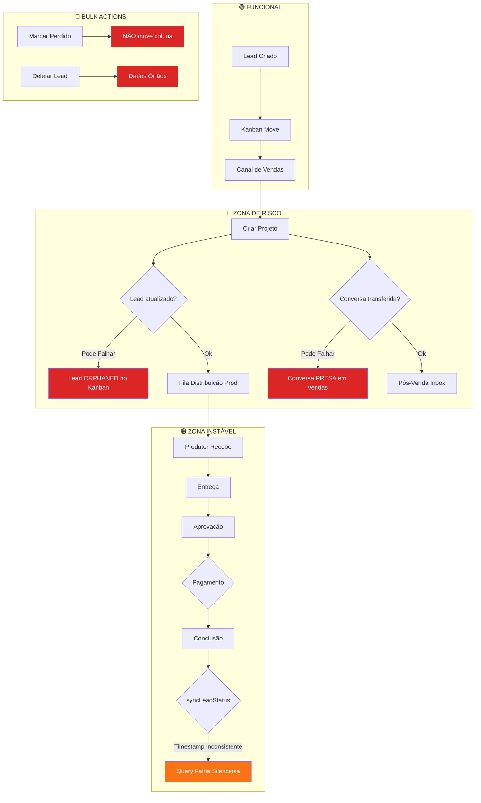

# 🔴 AUDITORIA COMPLETA: Fluxo Lead → Conversa → Projeto → Cliente → Contatos

> Auditoria realizada em 10/02/2026, cobrindo **todos** os services, stores, types e componentes críticos do fluxo CRM do Nobre Hub.

---

## Resumo Executivo

| Severidade | Quantidade | Impacto |
|-----------|-----------|---------|
| 🔴 **Crítico** | 8 | Perda de dados, prejuízo financeiro direto |
| 🟠 **Alto** | 7 | Inconsistência de dados, falhas operacionais |
| 🟡 **Médio** | 7 | Escalabilidade, manutenção, UX |

---

## 🔴 FALHAS CRÍTICAS (Perda de dados / Prejuízo financeiro)

### C1. Transição Lead → Projeto NÃO é atômica (pode criar projeto sem atualizar lead)

**Arquivo:** [CreateProjectModal.tsx](file:///c:/Users/nobre/Documents/PROJETOS/VIBECODING/NOBRE%20HUB%20-%20ANTIGRAVITY%20RUSSIA/src/features/production/components/CreateProjectModal.tsx#L178-L255)

**Problema:** O [handleSubmit](file:///c:/Users/nobre/Documents/PROJETOS/VIBECODING/NOBRE%20HUB%20-%20ANTIGRAVITY%20RUSSIA/src/features/production/components/CreateProjectModal.tsx#144-261) executa 3 operações em sequência que podem falhar parcialmente:

1. `addProject()` — cria o projeto ✅
2. `LeadService.updateOrCreateLead()` — atualiza o lead ❌ (pode falhar)
3. `InboxService.transferToPostSales()` — transfere conversa ❌ (pode falhar)

**As falhas em (2) e (3) são engolidas com `catch` que apenas loga no console.**

```typescript
// Linha 233: O erro é ENGOLIDO!
} catch (error) {
    console.error('Erro ao atualizar lead para pós-venda:', error);
    // Não bloqueia o fluxo, projeto foi criado
}
```

**Impacto:** Um projeto é criado na produção, mas o lead NUNCA entra na fila de pós-vendas. O cliente fica invisível no pós-venda. **O cliente pode nunca ser atendido após a compra.**

> [!CAUTION]
> Isto já pode estar acontecendo em produção sem ninguém perceber. Um projeto existe, mas o lead não foi marcado como `distribution` e fica preso no Kanban de vendas.

---

### C2. [bulkMarkAsLost](file:///c:/Users/nobre/Documents/PROJETOS/VIBECODING/NOBRE%20HUB%20-%20ANTIGRAVITY%20RUSSIA/src/features/crm/services/LeadService.ts#442-464) NÃO move o lead para coluna correta

**Arquivo:** [LeadService.ts](file:///c:/Users/nobre/Documents/PROJETOS/VIBECODING/NOBRE%20HUB%20-%20ANTIGRAVITY%20RUSSIA/src/features/crm/services/LeadService.ts#L445-L463)

**Problema:** Quando leads são marcados como perdidos em bulk, apenas `lostReason` e `lostAt` são escritos. O `status` do lead **não é alterado** para a coluna "Perdido" e o `dealStatus` **não é definido** como `'lost'`.

```typescript
// O que é salvo:
{ lostReason: lossReasonId, lostAt: Timestamp, updatedAt: Timestamp }

// O que FALTA:
// status: 'perdido' (ou o stageId da coluna Perdido)
// dealStatus: 'lost'
// pipeline: (manter o pipeline atual)
```

**Impacto:** Leads marcados como perdidos FICAM VISÍVEIS na coluna atual do Kanban. A vendedora continua vendo leads mortos como se fossem ativos. Relatórios de conversão são incorretos.

---

### C3. [bulkDelete](file:///c:/Users/nobre/Documents/PROJETOS/VIBECODING/NOBRE%20HUB%20-%20ANTIGRAVITY%20RUSSIA/src/features/crm/services/LeadService.ts#465-482) apaga leads SEM verificar vínculos com projetos/pós-vendas

**Arquivo:** [LeadService.ts](file:///c:/Users/nobre/Documents/PROJETOS/VIBECODING/NOBRE%20HUB%20-%20ANTIGRAVITY%20RUSSIA/src/features/crm/services/LeadService.ts#L468-L481)

**Problema:** [bulkDelete](file:///c:/Users/nobre/Documents/PROJETOS/VIBECODING/NOBRE%20HUB%20-%20ANTIGRAVITY%20RUSSIA/src/features/crm/services/LeadService.ts#465-482) simplesmente exclui os documentos Firestore sem verificar:
- Se o lead tem projetos vinculados (`projectIds`)
- Se o lead está em pós-venda (`currentSector === 'pos_vendas'`)
- Se existe conversa no RTDB vinculada ao lead

```typescript
// Deletado sem nenhuma verificação:
const deletePromises = leadIds.map(id => deleteDoc(doc(db, COLLECTION_NAME, id)));
```

**Impacto:** Ao deletar um lead que está em pós-venda, o sistema gera **dados órfãos**:
- Projetos com `leadId` apontando para lead que não existe
- Conversas no RTDB referenciando lead inexistente  
- Registros no pós-venda com client que desapareceu

> [!CAUTION]
> Se um operador deletar um lead ativo por engano, o cliente literalmente **desaparece** de todos os sistemas sem possibilidade de recuperação.

---

### C4. [reorderLead](file:///c:/Users/nobre/Documents/PROJETOS/VIBECODING/NOBRE%20HUB%20-%20ANTIGRAVITY%20RUSSIA/src/features/crm/stores/useKanbanStore.ts#137-202) NÃO persiste a reordenação da coluna de ORIGEM

**Arquivo:** [useKanbanStore.ts](file:///c:/Users/nobre/Documents/PROJETOS/VIBECODING/NOBRE%20HUB%20-%20ANTIGRAVITY%20RUSSIA/src/features/crm/stores/useKanbanStore.ts#L137-L201)

**Problema:** Ao mover um lead entre colunas via drag-and-drop, o código calcula novos [order](file:///c:/Users/nobre/Documents/PROJETOS/VIBECODING/NOBRE%20HUB%20-%20ANTIGRAVITY%20RUSSIA/src/features/crm/stores/useKanbanStore.ts#137-202) values para ambas colunas (origem e destino), mas o `sync with backend` **só envia updates para a coluna de DESTINO**:

```typescript
// Linha 190-196: Só persiste a coluna destino!
const targetUpdates = currentLeads
    .filter(l => l.status === targetStatus)
    .map(l => LeadService.updateLead(l.id, { status: l.status, order: l.order }));

await Promise.all(targetUpdates);
// SOURCE COLUMN UPDATES NEVER PERSISTED!
```

**Impacto:** Ao recarregar a página, os leads da coluna de origem voltam à ordem antiga. Em uso real com múltiplos vendedores, causa confusão constante porque a ordenação "reseta" entre sessões.

---

### C5. Inconsistência de timestamps entre services (Date vs Timestamp)

**Múltiplos arquivos afetados.**

**Problema:** Alguns services usam `new Date()` e outros `Timestamp.fromDate(new Date())` para gravar no Firestore:

| Service | Método Usado | Risco |
|---------|-------------|-------|
| [LeadService.updateLead](file:///c:/Users/nobre/Documents/PROJETOS/VIBECODING/NOBRE%20HUB%20-%20ANTIGRAVITY%20RUSSIA/src/features/crm/services/LeadService.ts#L84) | `Timestamp.fromDate()` ✅ | - |
| [PostSalesDistributionService.assignToPostSales](file:///c:/Users/nobre/Documents/PROJETOS/VIBECODING/NOBRE%20HUB%20-%20ANTIGRAVITY%20RUSSIA/src/features/pos-vendas/services/PostSalesDistributionService.ts#L192-L195) | `new Date()` ❌ | Timestamp é serializado como objeto JSON |
| [PostSalesDistributionService.updateClientStatus](file:///c:/Users/nobre/Documents/PROJETOS/VIBECODING/NOBRE%20HUB%20-%20ANTIGRAVITY%20RUSSIA/src/features/pos-vendas/services/PostSalesDistributionService.ts#L259-L262) | `new Date()` ❌ | Idem |
| [PostSalesDistributionService.syncLeadStatusFromProjects](file:///c:/Users/nobre/Documents/PROJETOS/VIBECODING/NOBRE%20HUB%20-%20ANTIGRAVITY%20RUSSIA/src/features/pos-vendas/services/PostSalesDistributionService.ts#L297-L303) | `new Date()` ❌ | Idem |
| [PostSalesDistributionService.completeClient](file:///c:/Users/nobre/Documents/PROJETOS/VIBECODING/NOBRE%20HUB%20-%20ANTIGRAVITY%20RUSSIA/src/features/pos-vendas/services/PostSalesDistributionService.ts#L345-L348) | `new Date()` ❌ | Idem |
| [ProductionDistributionService.assignToProducer](file:///c:/Users/nobre/Documents/PROJETOS/VIBECODING/NOBRE%20HUB%20-%20ANTIGRAVITY%20RUSSIA/src/features/production/services/ProductionDistributionService.ts#L164-L166) | `new Date()` ❌ | Idem |

**Impacto:** Quando um `Date` object é enviado ao Firestore via `updateDoc()`, ele é gravado como um **map** `{seconds: X, nanoseconds: Y}` em vez de um Firestore [Timestamp](file:///c:/Users/nobre/Documents/PROJETOS/VIBECODING/NOBRE%20HUB%20-%20ANTIGRAVITY%20RUSSIA/src/types/common.types.ts#90-94) nativo. Isso quebra **todas as queries `orderBy`** e comparações de data porque o tipo armazenado é diferente do esperado.

> [!WARNING]
> Queries como `orderBy('dealClosedAt', 'asc')` na distribution queue podem retornar resultados errados ou falhar silenciosamente se o campo foi gravado como `Date` em vez de [Timestamp](file:///c:/Users/nobre/Documents/PROJETOS/VIBECODING/NOBRE%20HUB%20-%20ANTIGRAVITY%20RUSSIA/src/types/common.types.ts#90-94).

---

### C6. [updateLead](file:///c:/Users/nobre/Documents/PROJETOS/VIBECODING/NOBRE%20HUB%20-%20ANTIGRAVITY%20RUSSIA/src/features/crm/services/LeadService.ts#74-95) não filtra `undefined` values — risco de crash Firestore

**Arquivo:** [LeadService.ts](file:///c:/Users/nobre/Documents/PROJETOS/VIBECODING/NOBRE%20HUB%20-%20ANTIGRAVITY%20RUSSIA/src/features/crm/services/LeadService.ts#L77-L93)

**Problema:** O método [updateLead](file:///c:/Users/nobre/Documents/PROJETOS/VIBECODING/NOBRE%20HUB%20-%20ANTIGRAVITY%20RUSSIA/src/features/crm/services/LeadService.ts#74-95) faz spread dos updates sem remover campos `undefined`:

```typescript
const dataToUpdate: any = { ...updates };
dataToUpdate.updatedAt = Timestamp.fromDate(new Date());
if (updates.createdAt) delete dataToUpdate.createdAt;
await updateDoc(docRef, dataToUpdate);
```

Se qualquer caller passar `{ temperature: undefined }`, o Firestore **rejeita com `FirebaseError`** porque não aceita valores `undefined`. O único campo protegido é `createdAt`.

**Impacto:** Qualquer componente que passe um campo `undefined` no objeto de updates causa crash silencioso (o `catch` só loga no console). Especialmente perigoso no `NegociosTab.handleSave` que faz:
```typescript
temperature: (formData.temperature || undefined) as Lead['temperature']
```

---

### C7. Zero testes automatizados

**Impacto:** Não existe nenhum arquivo `.test.ts`, `.test.tsx`, `.spec.ts` ou `.spec.tsx` em todo o projeto.

> [!CAUTION]
> Um CRM que fatura R$ 300K/mês opera SEM NENHUM teste automatizado. Qualquer refatoração, atualização de dependência ou mudança de lógica pode introduzir bugs que passarão despercebidos até um cliente real ser afetado.

---

### C8. `arrayUnion` usado com `updateDoc` de updates genéricas pode sobrescrever

**Arquivo:** [CreateProjectModal.tsx](file:///c:/Users/nobre/Documents/PROJETOS/VIBECODING/NOBRE%20HUB%20-%20ANTIGRAVITY%20RUSSIA/src/features/production/components/CreateProjectModal.tsx#L225-L226)

**Problema:** `arrayUnion(projectId)` é forçado via type cast `as unknown as string[]` para ser colocado dentro do objeto de updates de [updateOrCreateLead](file:///c:/Users/nobre/Documents/PROJETOS/VIBECODING/NOBRE%20HUB%20-%20ANTIGRAVITY%20RUSSIA/src/features/crm/services/LeadService.ts#96-151). Porém, no branch de `else if (createData)` (linhas 127-141), o spread `...updates` aplica esse valor que NÃO é um array simples — é uma **sentinel value** do Firestore:

```typescript
await setDoc(docRef, {
    name: createData.name,
    ...updates,  // <-- contém arrayUnion() que não funciona em setDoc sem merge
    createdAt: Timestamp.fromDate(now),
});
```

**Impacto:** Se o lead não existir e for criado pelo `setDoc`, o campo `projectIds` NÃO será um array. Será um objeto sentinel serializado incorretamente. Projetos criados para leads novos (vindos do inbox) perdem o vínculo.

---

## 🟠 FALHAS DE ALTO RISCO (Inconsistência de dados / Falhas operacionais)

### H1. [syncConversationAssignment](file:///c:/Users/nobre/Documents/PROJETOS/VIBECODING/NOBRE%20HUB%20-%20ANTIGRAVITY%20RUSSIA/src/features/pos-vendas/services/PostSalesDistributionService.ts#155-178) carrega TODAS as conversas do RTDB

**Arquivo:** [PostSalesDistributionService.ts](file:///c:/Users/nobre/Documents/PROJETOS/VIBECODING/NOBRE%20HUB%20-%20ANTIGRAVITY%20RUSSIA/src/features/pos-vendas/services/PostSalesDistributionService.ts#L155-L177)

**Problema:** Para encontrar uma conversa por `leadId`, o serviço faz download de **TODOS** os dados do nó `/conversations`:

```typescript
const snapshot = await get(conversationsRef); // Busca TUDO
const data = snapshot.val() as Record<string, any>;
const conversationId = Object.keys(data).find(id => data[id]?.leadId === leadId);
```

**Impacto:** Com 1000+ conversas, cada chamada de atribuição de pós-venda baixa centenas de KB de dados do RTDB. Multiplique pela auto-atribuição de múltiplos clientes ([autoAssignAllPending](file:///c:/Users/nobre/Documents/PROJETOS/VIBECODING/NOBRE%20HUB%20-%20ANTIGRAVITY%20RUSSIA/src/features/production/services/ProductionDistributionService.ts#233-262)) e você tem N × full-downloads. **Custo de bandwidth do Firebase acumula rapidamente.**

---

### H2. `PostSalesInboxService.subscribeToConversations` faz filtro 100% client-side

**Arquivo:** [PostSalesInboxService.ts](file:///c:/Users/nobre/Documents/PROJETOS/VIBECODING/NOBRE%20HUB%20-%20ANTIGRAVITY%20RUSSIA/src/features/pos-vendas/services/PostSalesInboxService.ts#L17-L59)

**Problema:** O listener faz `onValue` no nó `/conversations` inteiro e usa 3 camadas de `.filter()` client-side:

```typescript
.filter((conv) => conv.context === 'post_sales')
.filter((conv) => postSalesId ? conv.assignedTo === postSalesId : !conv.assignedTo)  
.filter((conv) => conv.status === 'open')
```

**Impacto:** Cada agente de pós-venda recebe TODAS as conversas de TODOS os contextos em tempo real. 10 agentes = 10 listeners, cada um recebendo os dados de todos. **Uso de bandwidth e memória cresce linearmente com o time.**

---

### H3. [subscribeToConversationByLeadId](file:///c:/Users/nobre/Documents/PROJETOS/VIBECODING/NOBRE%20HUB%20-%20ANTIGRAVITY%20RUSSIA/src/features/inbox/services/InboxService.ts#72-103) no InboxService baixa TUDO a cada mudança

**Arquivo:** [InboxService.ts](file:///c:/Users/nobre/Documents/PROJETOS/VIBECODING/NOBRE%20HUB%20-%20ANTIGRAVITY%20RUSSIA/src/features/inbox/services/InboxService.ts#L76-L102)

**Problema:** Idêntico ao H1/H2 — um `onValue` no nó inteiro de conversations, filtrando client-side:

```typescript
return onValue(conversationsRef, (snapshot) => {
    const found = Object.keys(data).find(key => data[key].leadId === leadId);
});
```

**Impacto:** Cada vez que QUALQUER conversa recebe uma atualização, este listener re-executa, pegando TUDO do RTDB.

---

### H4. [completeClient](file:///c:/Users/nobre/Documents/PROJETOS/VIBECODING/NOBRE%20HUB%20-%20ANTIGRAVITY%20RUSSIA/src/features/pos-vendas/services/PostSalesDistributionService.ts#339-370) pode deixar lead em estado inconsistente

**Arquivo:** [PostSalesDistributionService.ts](file:///c:/Users/nobre/Documents/PROJETOS/VIBECODING/NOBRE%20HUB%20-%20ANTIGRAVITY%20RUSSIA/src/features/pos-vendas/services/PostSalesDistributionService.ts#L339-L369)

**Problema:** O método tem dois branches:

1. **Com projectId**: Atualiza projeto como `paid`/`concluido`, depois chama [syncLeadStatusFromProjects](file:///c:/Users/nobre/Documents/PROJETOS/VIBECODING/NOBRE%20HUB%20-%20ANTIGRAVITY%20RUSSIA/src/features/pos-vendas/services/PostSalesDistributionService.ts#286-315) que verifica se TODOS os projetos estão concluídos
2. **Sem projectId**: Simplesmente marca o lead como `concluido` e `currentSector: 'vendas'`

O branch (2) ignora completamente os projetos. Se o operador clicar "concluir" sem projectId, o lead volta para vendas mas os projetos ficam em estados intermediários.

Além disso, `postSalesDistributionStatus: null` é escrito ao Firestore — mas `null` em Firestore não deleta o campo, ele o mantém com valor `null`, o que pode confundir queries que usam `where('postSalesDistributionStatus', '==', 'pending')`.

---

### H5. [requestRevision](file:///c:/Users/nobre/Documents/PROJETOS/VIBECODING/NOBRE%20HUB%20-%20ANTIGRAVITY%20RUSSIA/src/features/pos-vendas/services/PostSalesDistributionService.ts#424-465) duplica atualização de status (redundante + race condition)

**Arquivo:** [PostSalesDistributionService.ts](file:///c:/Users/nobre/Documents/PROJETOS/VIBECODING/NOBRE%20HUB%20-%20ANTIGRAVITY%20RUSSIA/src/features/pos-vendas/services/PostSalesDistributionService.ts#L424-L463)

**Problema:** O método faz:
1. Atualiza o lead com `clientStatus: 'aguardando_alteracao'` (linha 433)
2. Atualiza o projeto com `status: 'alteracao'` (linha 449-456)
3. Chama [updateClientStatus(leadId, 'aguardando_alteracao')](file:///c:/Users/nobre/Documents/PROJETOS/VIBECODING/NOBRE%20HUB%20-%20ANTIGRAVITY%20RUSSIA/src/features/pos-vendas/services/PostSalesDistributionService.ts#256-268) NOVAMENTE (linha 459)

A etapa (3) é **redundante** — faz exatamente o mesmo que a etapa (1). Além de ser uma operação de escrita desnecessária no Firestore, há risco de race condition se outro processo atualizar o lead entre (1) e (3).

---

### H6. [autoAssignProject](file:///c:/Users/nobre/Documents/PROJETOS/VIBECODING/NOBRE%20HUB%20-%20ANTIGRAVITY%20RUSSIA/src/features/production/services/ProductionDistributionService.ts#175-232) usa query desnecessária para buscar projeto por ID

**Arquivo:** [ProductionDistributionService.ts](file:///c:/Users/nobre/Documents/PROJETOS/VIBECODING/NOBRE%20HUB%20-%20ANTIGRAVITY%20RUSSIA/src/features/production/services/ProductionDistributionService.ts#L187-L189)

**Problema:** Para buscar um projeto por ID, usa uma query `where('__name__', '==', projectId)` em vez de simplesmente `getDoc(doc(db, COLLECTION_NAME, projectId))`:

```typescript
// Ineficiente:
const projectSnapshot = await getDocs(
    query(projectsRef, where('__name__', '==', projectId))
);

// Deveria ser:
const projectSnapshot = await getDoc(doc(db, COLLECTION_NAME, projectId));
```

**Impacto:** `getDocs` com query consome **1 leitura de index + 1 leitura de documento** = 2 leituras. `getDoc` consome apenas **1 leitura**. Com auto-distribuição de muitos projetos, esses custos dobrados acumulam.

---

### H7. Bulk operations sem usar `writeBatch` — inconsistência parcial

**Múltiplos métodos afetados:** [bulkMarkAsLost](file:///c:/Users/nobre/Documents/PROJETOS/VIBECODING/NOBRE%20HUB%20-%20ANTIGRAVITY%20RUSSIA/src/features/crm/services/LeadService.ts#442-464), [bulkMoveStage](file:///c:/Users/nobre/Documents/PROJETOS/VIBECODING/NOBRE%20HUB%20-%20ANTIGRAVITY%20RUSSIA/src/features/crm/services/LeadService.ts#415-441), [bulkAssignResponsible](file:///c:/Users/nobre/Documents/PROJETOS/VIBECODING/NOBRE%20HUB%20-%20ANTIGRAVITY%20RUSSIA/src/features/crm/services/LeadService.ts#389-414), [bulkDelete](file:///c:/Users/nobre/Documents/PROJETOS/VIBECODING/NOBRE%20HUB%20-%20ANTIGRAVITY%20RUSSIA/src/features/crm/services/LeadService.ts#465-482), [bulkAddTag](file:///c:/Users/nobre/Documents/PROJETOS/VIBECODING/NOBRE%20HUB%20-%20ANTIGRAVITY%20RUSSIA/src/features/crm/services/LeadService.ts#210-236), [bulkRemoveTags](file:///c:/Users/nobre/Documents/PROJETOS/VIBECODING/NOBRE%20HUB%20-%20ANTIGRAVITY%20RUSSIA/src/features/crm/services/LeadService.ts#165-209).

**Problema:** Todos usam `Promise.all()` com updates individuais em vez de `writeBatch()`:

```typescript
const updatePromises = leadIds.map(id =>
    updateDoc(doc(db, COLLECTION_NAME, id), { ... })
);
await Promise.all(updatePromises);
```

**Impacto:** Se a operação falhar no meio (ex: perda de conexão, ou Firestore rate limit), **alguns leads são atualizados e outros não**. O operador vê "Erro", mas metade das operações já executou. Não há rollback.

O Firestore suporta `writeBatch()` com até 500 operações atômicas. Para um CRM de 300K/mês, isso deveria ser obrigatório.

---

## 🟡 FALHAS DE MÉDIO RISCO (Escalabilidade, manutenção, UX)

### M1. [searchAllProjects](file:///c:/Users/nobre/Documents/PROJETOS/VIBECODING/NOBRE%20HUB%20-%20ANTIGRAVITY%20RUSSIA/src/features/production/services/ProductionService.ts#63-99) baixa TODOS os projetos para filtrar no client

**Arquivo:** [ProductionService.ts](file:///c:/Users/nobre/Documents/PROJETOS/VIBECODING/NOBRE%20HUB%20-%20ANTIGRAVITY%20RUSSIA/src/features/production/services/ProductionService.ts#L66-L98)

O comentário no código reconhece: *"This is safer for UX (case insensitive, partial match) until dataset > 1000."* Com 300K/mês, o volume de projetos vai ultrapassar 1000 rapidamente.

---

### M2. [getLeads()](file:///c:/Users/nobre/Documents/PROJETOS/VIBECODING/NOBRE%20HUB%20-%20ANTIGRAVITY%20RUSSIA/src/features/crm/services/LeadService.ts#22-47) carrega TODOS os leads sem paginação

**Arquivo:** [LeadService.ts](file:///c:/Users/nobre/Documents/PROJETOS/VIBECODING/NOBRE%20HUB%20-%20ANTIGRAVITY%20RUSSIA/src/features/crm/services/LeadService.ts#L25-L46)

O `ContactsStore` e o `KanbanStore` ambos chamam [getLeads()](file:///c:/Users/nobre/Documents/PROJETOS/VIBECODING/NOBRE%20HUB%20-%20ANTIGRAVITY%20RUSSIA/src/features/crm/services/LeadService.ts#22-47) que retorna **TODOS os leads do Firestore**. Os filtros e paginação no [useFilteredContacts](file:///c:/Users/nobre/Documents/PROJETOS/VIBECODING/NOBRE%20HUB%20-%20ANTIGRAVITY%20RUSSIA/src/features/crm/stores/useContactsStore.ts#162-200) são 100% client-side. Conforme a base cresce, o load time inicial do app vai aumentar linearmente.

---

### M3. [Conversation](file:///c:/Users/nobre/Documents/PROJETOS/VIBECODING/NOBRE%20HUB%20-%20ANTIGRAVITY%20RUSSIA/src/features/inbox/types.ts#4-45) tipo duplica campos do [Lead](file:///c:/Users/nobre/Documents/PROJETOS/VIBECODING/NOBRE%20HUB%20-%20ANTIGRAVITY%20RUSSIA/src/types/lead.types.ts#21-70)

**Arquivos:** [inbox/types.ts](file:///c:/Users/nobre/Documents/PROJETOS/VIBECODING/NOBRE%20HUB%20-%20ANTIGRAVITY%20RUSSIA/src/features/inbox/types.ts) e [lead.types.ts](file:///c:/Users/nobre/Documents/PROJETOS/VIBECODING/NOBRE%20HUB%20-%20ANTIGRAVITY%20RUSSIA/src/types/lead.types.ts)

Os campos `leadName`, `leadPhone`, `leadEmail`, `leadCompany`, `tags`, `notes` existem TANTO na [Conversation](file:///c:/Users/nobre/Documents/PROJETOS/VIBECODING/NOBRE%20HUB%20-%20ANTIGRAVITY%20RUSSIA/src/features/inbox/types.ts#4-45) (RTDB) quanto no [Lead](file:///c:/Users/nobre/Documents/PROJETOS/VIBECODING/NOBRE%20HUB%20-%20ANTIGRAVITY%20RUSSIA/src/types/lead.types.ts#21-70) (Firestore). O `InboxService.updateConversationDetails` faz sync bidirecional, mas se alguém editar tags pelo Kanban (sem tocar a conversation), a conversa fica desatualizada.

---

### M4. `User.isActive` vs `User.active` — duplicação ambígua

**Arquivo:** [user.types.ts](file:///c:/Users/nobre/Documents/PROJETOS/VIBECODING/NOBRE%20HUB%20-%20ANTIGRAVITY%20RUSSIA/src/types/user.types.ts#L21-L22)

```typescript
isActive?: boolean;
active?: boolean;
```

Dois campos opcionais para representar a mesma coisa. Dependendo de qual service consulta qual campo, um colaborador pode aparecer ativo num lugar e inativo em outro.

---

### M5. [DealStatus](file:///c:/Users/nobre/Documents/PROJETOS/VIBECODING/NOBRE%20HUB%20-%20ANTIGRAVITY%20RUSSIA/src/types/lead.types.ts#8-9) definido em dois arquivos diferentes

**Arquivos:** [lead.types.ts](file:///c:/Users/nobre/Documents/PROJETOS/VIBECODING/NOBRE%20HUB%20-%20ANTIGRAVITY%20RUSSIA/src/types/lead.types.ts#L8) e [inbox/types.ts](file:///c:/Users/nobre/Documents/PROJETOS/VIBECODING/NOBRE%20HUB%20-%20ANTIGRAVITY%20RUSSIA/src/features/inbox/types.ts#L1)

Ambos declaram `export type DealStatus = 'open' | 'won' | 'lost';`. Se um for alterado sem o outro, eles ficam desincronizados.

---

### M6. [seedDatabase](file:///c:/Users/nobre/Documents/PROJETOS/VIBECODING/NOBRE%20HUB%20-%20ANTIGRAVITY%20RUSSIA/src/features/inbox/services/InboxService.ts#630-738) no InboxService está em código de produção

**Arquivo:** [InboxService.ts](file:///c:/Users/nobre/Documents/PROJETOS/VIBECODING/NOBRE%20HUB%20-%20ANTIGRAVITY%20RUSSIA/src/features/inbox/services/InboxService.ts#L633-L737)

O método [seedDatabase](file:///c:/Users/nobre/Documents/PROJETOS/VIBECODING/NOBRE%20HUB%20-%20ANTIGRAVITY%20RUSSIA/src/features/inbox/services/InboxService.ts#630-738) que limpa TODAS as conversas e mensagens ([set(ref(db, 'conversations'), null)](file:///c:/Users/nobre/Documents/PROJETOS/VIBECODING/NOBRE%20HUB%20-%20ANTIGRAVITY%20RUSSIA/src/features/crm/stores/useContactsStore.ts#155-156)) está disponível em produção sem proteção. Se um botão chamar isso por engano, **todas as conversas são apagadas**.

---

### M7. [bulkAssignResponsible](file:///c:/Users/nobre/Documents/PROJETOS/VIBECODING/NOBRE%20HUB%20-%20ANTIGRAVITY%20RUSSIA/src/features/crm/services/LeadService.ts#389-414) para pós-venda NÃO atualiza campos complementares

**Arquivo:** [ContactsQuickActions.tsx](file:///c:/Users/nobre/Documents/PROJETOS/VIBECODING/NOBRE%20HUB%20-%20ANTIGRAVITY%20RUSSIA/src/features/crm/components/Contacts/ContactsQuickActions.tsx#L266-L294)

Ao atribuir pós-venda via bulk action, apenas `postSalesId` é atualizado. **Não** atualiza `currentSector`, `clientStatus`, `postSalesDistributionStatus`, ou `postSalesAssignedAt`. O lead fica com `postSalesId` preenchido mas sem os campos necessários para aparecer nas listas de pós-venda.

---

## 📊 Mapa de Risco Visual



---

## 🎯 Prioridade de Correção Sugerida

| Prioridade | Issue | Esforço |
|-----------|-------|---------|
| 1️⃣ | **C1** — Transição atômica Lead→Projeto | Médio |
| 2️⃣ | **C5** — Padronizar timestamps (`Timestamp.fromDate()`) | Baixo |
| 3️⃣ | **C2** — [bulkMarkAsLost](file:///c:/Users/nobre/Documents/PROJETOS/VIBECODING/NOBRE%20HUB%20-%20ANTIGRAVITY%20RUSSIA/src/features/crm/services/LeadService.ts#442-464) atualizar status/pipeline | Baixo |
| 4️⃣ | **C3** — [bulkDelete](file:///c:/Users/nobre/Documents/PROJETOS/VIBECODING/NOBRE%20HUB%20-%20ANTIGRAVITY%20RUSSIA/src/features/crm/services/LeadService.ts#465-482) verificar vínculos | Baixo |
| 5️⃣ | **C4** — [reorderLead](file:///c:/Users/nobre/Documents/PROJETOS/VIBECODING/NOBRE%20HUB%20-%20ANTIGRAVITY%20RUSSIA/src/features/crm/stores/useKanbanStore.ts#137-202) persistir coluna de origem | Baixo |
| 6️⃣ | **C6** — Filtrar `undefined` no [updateLead](file:///c:/Users/nobre/Documents/PROJETOS/VIBECODING/NOBRE%20HUB%20-%20ANTIGRAVITY%20RUSSIA/src/features/crm/services/LeadService.ts#74-95) | Baixo |
| 7️⃣ | **C8** — Fix `arrayUnion` no `setDoc` | Baixo |
| 8️⃣ | **H7** — Migrar bulk operations para `writeBatch` | Médio |
| 9️⃣ | **H1/H2/H3** — Otimizar queries RTDB | Alto |
| 🔟 | **M7** — `bulkAssignPosVenda` completar campos | Baixo |

---

> [!IMPORTANT]
> **As 8 falhas críticas (C1-C8) devem ser corrigidas ANTES de operar o CRM com clientes reais de alto valor.** Os itens C1, C2 e C3 têm potencial de causar perda direta de clientes que geram receita.
