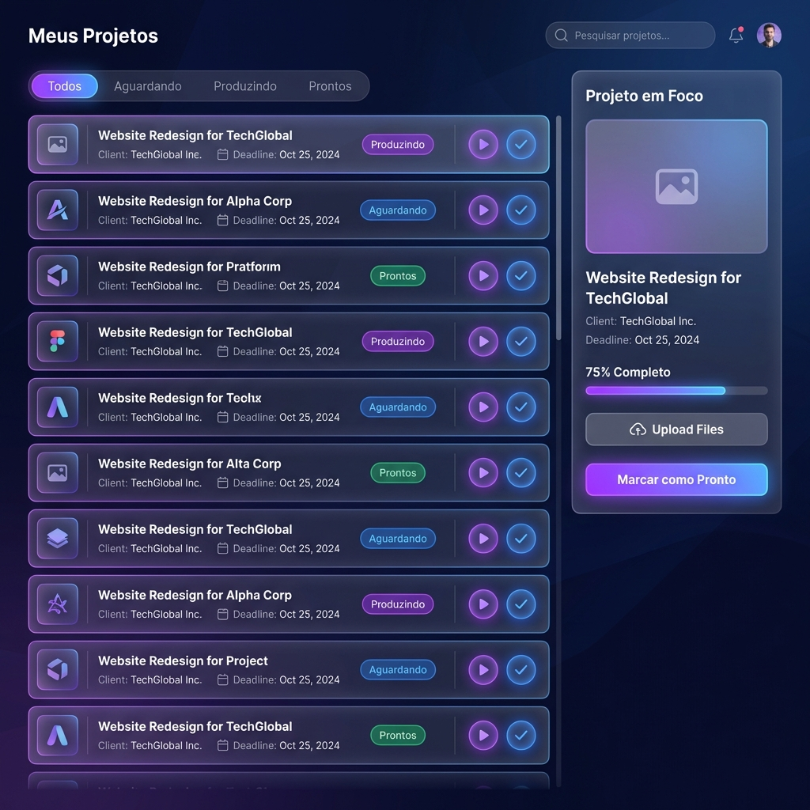
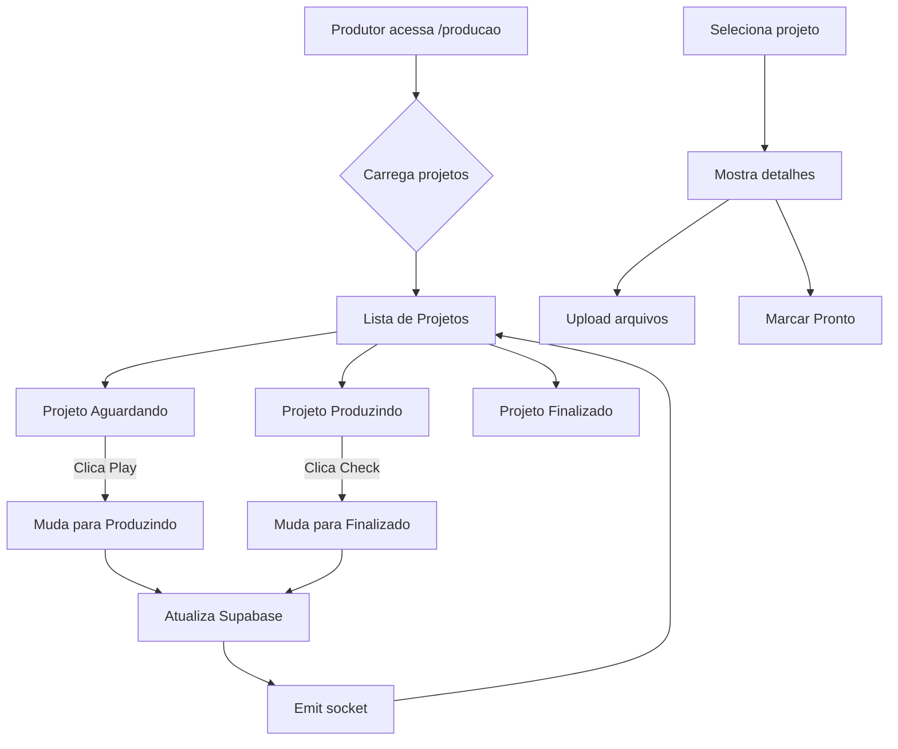

# Production Dashboard - Especificação Técnica

## Objetivo

Criar um painel dedicado para **produtores**, substituindo a visualização Kanban tradicional. O foco é produtividade individual: cada produtor vê apenas seus projetos atribuídos com ações rápidas inline.

---

## Mockup de Referência



---

## Diagrama de Fluxo



---

## Especificação de Componentes

### 1. `ProductionDashboard.tsx` (Componente Principal)

**Localização:** `src/components/production/ProductionDashboard.tsx`

**Responsabilidades:**
- Fetch de projetos do pipeline `production` atribuídos ao usuário logado
- Gerenciar filtros (Aguardando / Finalizados)
- Renderizar lista + painel lateral

**Props:** Nenhuma (usa contexto de auth)

---

### 2. `ProjectListItem.tsx` (Item da Lista)

**Props:**
```typescript
interface ProjectListItemProps {
  id: string;
  title: string;
  clientName: string;
  deadline: string;
  status: 'waiting' | 'producing' | 'done';
  thumbnail?: string;
  isSelected: boolean;
  onSelect: (id: string) => void;
  onStatusChange: (id: string, newStatus: string) => void;
}
```

**Comportamento:**
- Clique no **Play ▶️** → muda status para `producing`
- Clique no **Check ✓** → muda status para `done`
- Clique na linha → seleciona projeto (mostra no painel lateral)

---

### 3. `ProjectFocusPanel.tsx` (Painel Lateral)

**Props:**
```typescript
interface ProjectFocusPanelProps {
  project: Project | null;
  onUploadFiles: (files: File[]) => void;
  onMarkAsDone: () => void;
}
```

**Elementos:**
- Thumbnail grande
- Nome do projeto e cliente
- Deadline
- Barra de progresso (opcional)
- Botão "Upload Files"
- Botão "Marcar como Pronto"

---

## Schema de Dados (Supabase)

### Tabela `leads` (projetos de produção)

Campos relevantes:
```sql
id: uuid
name: text              -- Nome do projeto
company: text           -- Nome do cliente
assigned_to: uuid       -- FK para profiles (produtor)
pipeline: text          -- 'production'
stage: text             -- 'waiting', 'producing', 'done'
deadline: timestamptz   -- Prazo
created_at: timestamptz
updated_at: timestamptz
```

### Query para buscar projetos do produtor:

```typescript
const { data } = await supabase
  .from('leads')
  .select('*, assignedUser:profiles!assigned_to(*)')
  .eq('pipeline', 'production')
  .eq('assigned_to', currentUserId)
  .order('deadline', { ascending: true });
```

---

## Comportamentos e Estados

### Estados de Status

| Status | Badge Color | Ícones Visíveis | Ação Possível |
|--------|-------------|-----------------|---------------|
| `waiting` | Laranja | ▶️ (play) | Iniciar produção |
| `producing` | Azul | ✓ (check) | Finalizar |
| `done` | Verde | Nenhum | - |

### Filtros

| Tab | O que mostra |
|-----|--------------|
| `Aguardando` | Projetos com status `waiting` OU `producing` |
| `Finalizados` | Projetos com status `done` |

---

## Estilos

**Cores (dark mode):**
- Background: `#0f172a` (slate-900)
- Cards: `#1e293b` (slate-800) com glassmorphism
- Accent: `#8b5cf6` (violet-500)
- Status waiting: `#f97316` (orange-500)
- Status producing: `#3b82f6` (blue-500)
- Status done: `#22c55e` (green-500)

**Fontes:** Inter (já em uso no projeto)

**Bordas:** `rounded-xl` (12px)

---

## Critérios de Aceite

- [ ] Produtor vê APENAS projetos atribuídos a ele
- [ ] Clique no Play muda status para "Produzindo"
- [ ] Clique no Check muda status para "Finalizado"
- [ ] Filtros funcionam (Aguardando / Finalizados)
- [ ] Selecionar projeto mostra detalhes no painel lateral
- [ ] Upload de arquivos funciona (pode ser placeholder para v2)
- [ ] Atualização em tempo real via socket/subscription
- [ ] Responsivo (funciona em tablet)

---

## Próximos Passos (v2)

1. Integração com Google Drive API para upload direto
2. Histórico de alterações de status
3. Comentários/notas no projeto
4. Notificações quando projeto é atribuído
