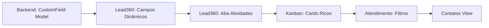

# 🚀 Plano Completo: Nobre Hub → Nível Clint CRM

> **Data:** 2026-01-21 | **API WhatsApp:** 360dialog (oficial) | **47 Screenshots analisados**

---

## ⚠️ Resultado da Verificação Backend

```diff
- NÃO existe suporte a Custom Fields no schema atual
- Campos do Lead são FIXOS: name, email, phone, company, source, notes, tags
- Será necessário criar novos models para campos personalizáveis
```

---

## 📋 ROADMAP COMPLETO (Todas as Melhorias)

### 🔴 Fase 1: Lead 360 Avançado (PRIORIDADE - Opção A)

#### O que vai mudar:

| Componente | Atual | Novo |
|------------|-------|------|
| Campos | Fixos, hardcoded | Dinâmicos + "Ocultar vazios" + "Gerenciar campos" |
| Aba Atividades | Simples | Playbook com cadências automáticas |
| Aba Contato | Básica | Campos expandidos (Instagram, UTM, Cargo, etc.) |
| Aba Empresa | Básica | CNPJ, Segmento, Funcionários, Categoria |
| Aba Histórico | Lista simples | Timeline visual com eventos detalhados |

#### Backend necessário:
```prisma
model CustomField {
  id        String  @id @default(uuid())
  name      String
  type      String  // text, number, date, select
  entity    String  // contact, company, deal
  options   Json?
  order     Int     @default(0)
  isVisible Boolean @default(true)
}

model Activity {
  id           String   @id @default(uuid())
  type         String   // call, whatsapp, email
  title        String
  dueDate      DateTime
  completed    Boolean  @default(false)
  daysFromLead Int      @default(1)
  leadId       String
}
```

---

### 🟡 Fase 2: Kanban Avançado (Melhorias Visuais)

#### Cards Ricos:
```
┌─────────────────────────────────────────┐
│ [Live03] [DM-Insta] [WhatsApp]    R$270 │  ← Múltiplos badges de origem
│ 🖼️ João Silva                          │
│ "Última msg: Olá, tenho interesse..."   │  ← Preview da última mensagem
│ 📱 💬 ✉️                    ⏰1/12 ⌛1h │  ← Atividades + Tempo na etapa
└─────────────────────────────────────────┘
```

#### Urgência Visual (cores por tempo):
- 🟢 Verde: < 6h
- 🟡 Amarelo: 6h - 24h
- 🔴 Vermelho: 1-3 dias
- ⚫ Crítico: > 3 dias

#### Tags Flutuantes:
- 🔥 "Compra aprovada"
- ⚠️ "Cartão recusado"
- 🛒 "Abandono de carrinho"

#### Header de Coluna:
```
┌────────────────────────────────────┐
│ 🟣 Novos                278  R$38k │  ← Contador + Valor total
└────────────────────────────────────┘
```

---

### 🟡 Fase 3: Atendimento (Filtros Avançados)

#### Sidebar de Filtros Expandida:
```
┌─────────────────────────────────────┐
│ 📋 Conversas                        │
│   ○ Atribuídas a mim / Não atribuídas│
│   ○ Aguardando resposta / Em espera │
│   ○ Dentro/Fora janela 24h          │
│                                     │
│ 🏷️ Negócios                         │
│   ○ Com/Sem negócio                 │
│   ○ Por etapa / Por origem          │
│   ○ Dono do negócio                 │
│                                     │
│ 👤 Contatos                         │
│   ○ Por tags / Por campos           │
│                                     │
│ 📱 Canais                           │
│   ○ WhatsApp / Instagram            │
└─────────────────────────────────────┘
```

---

### 🟢 Fase 4: Contatos View

#### Tabela com Filtros:
```
┌───────────────────────────────────────────────────────────────────┐
│ 🔍 │ Campos ▼ │ Tags ▼ │ Motivo de Perda ▼ │ Mais filtros ▼      │
├───────────────────────────────────────────────────────────────────┤
│ ☐ │ Nome        │ Telefone  │ Email      │ [Tags]     │ Negócios│
│ ☐ │ João Silva  │ 99999...  │ joao@...   │ [Engajado] │ 3       │
└───────────────────────────────────────────────────────────────────┘
```

#### Filtro "Motivo de Perda":
- Não informar
- Sem dinheiro
- Comprou concorrente
- Blacklist

---

### 🟢 Fase 5: Dashboard BI + Playbooks

- Gráficos de vendas por dia/produto
- Métricas de conversão por etapa
- Cadências automáticas de atividades
- Templates por estágio do funil

---

## 📁 Arquivos a Modificar/Criar

### Frontend:

| Arquivo | Ação | Descrição |
|---------|------|-----------|
| [Lead360Modal.tsx](file:///c:/Users/Editor/Desktop/PROJETOS%20CAIO/WEBDEV/nobre-crm/src/components/Lead360Modal.tsx) | MODIFICAR | Custom fields, "Ocultar vazios", Aba Atividades |
| [LeadCard.tsx](file:///c:/Users/Editor/Desktop/PROJETOS%20CAIO/WEBDEV/nobre-crm/src/components/kanban/LeadCard.tsx) | MODIFICAR | Badges múltiplos, tempo na etapa, preview msg |
| [KanbanColumn.tsx](file:///c:/Users/Editor/Desktop/PROJETOS%20CAIO/WEBDEV/nobre-crm/src/components/kanban/KanbanColumn.tsx) | MODIFICAR | Valor total, contador melhorado |
| `AdvancedFilters.tsx` | CRIAR | Sidebar de filtros expandida |
| `ContactsView.tsx` | CRIAR | Tabela com filtros e bulk actions |
| `CustomFieldsEditor.tsx` | CRIAR | Gerenciador de campos admin |

### Backend:

| Arquivo | Ação | Descrição |
|---------|------|-----------|
| [schema.prisma](file:///c:/Users/Editor/Desktop/PROJETOS%20CAIO/WEBDEV/nobre-crm/backend/prisma/schema.prisma) | MODIFICAR | Adicionar CustomField, Activity, LossReason |
| `customFields.ts` | CRIAR | CRUD de campos personalizados |
| `activities.ts` | CRIAR | CRUD de atividades/playbook |

---

## ✅ SEQUÊNCIA DE IMPLEMENTAÇÃO



**Estimativa:** 5-7 dias para implementação completa

---

> [!IMPORTANT]
> **Confirmado:** Todas as melhorias do Kanban (badges, tempo, urgência visual) continuam no plano. Elas são implementadas na Fase 2, logo após o Lead360.
